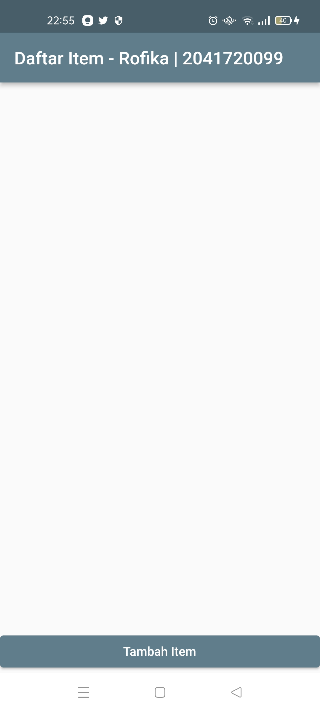
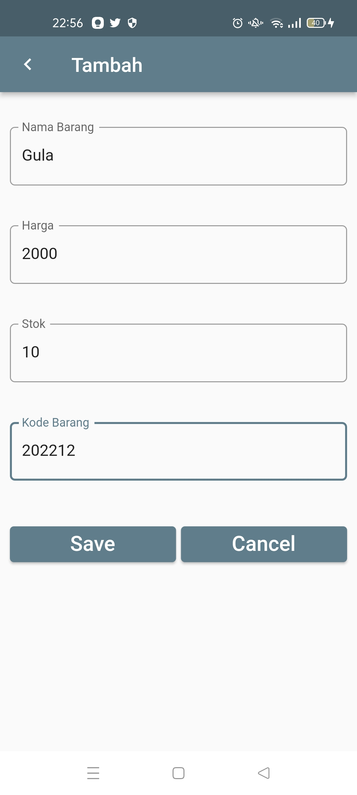
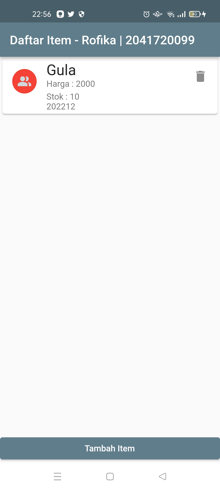
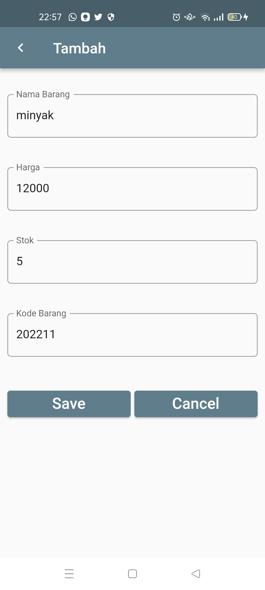
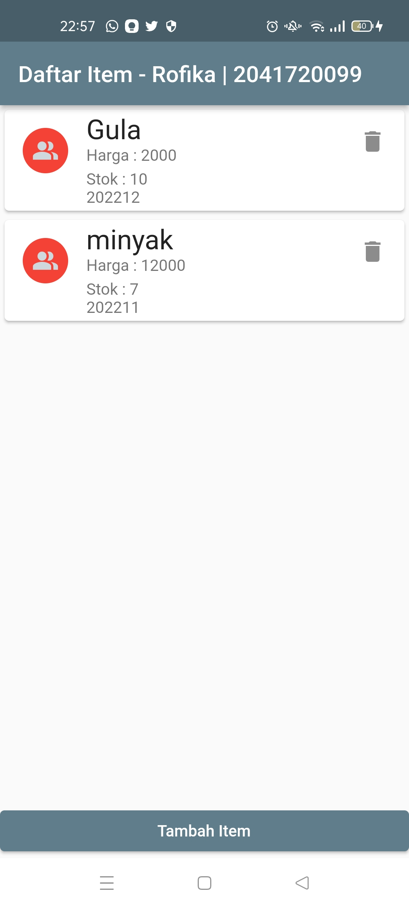
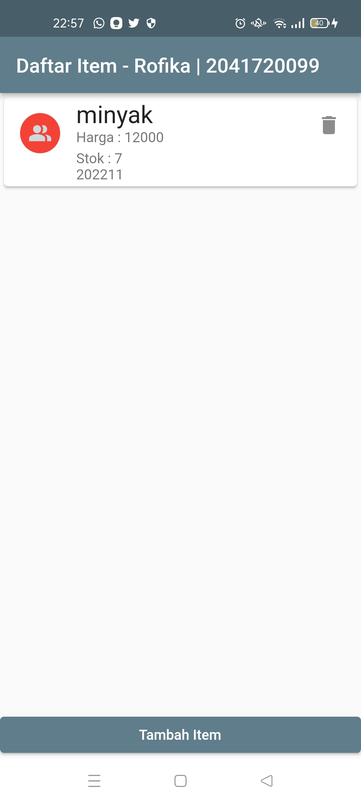

# flutter_sqflite

<li>Rofika Nur 'Aini</li>
<li>TI - 3B</li>
<li>2041720099</li>

## JOBSHEET 6 - DATABASE SQLITE

### Hasil Praktikum:

Tampilan Awal Aplikasi

Halaman Tambah Item (1)

ListView Setelah Menambah Item (1)

Halaman Tambah Item (2)

ListView Setelah Menambah Item (2)

Halaman Ubah Item (2)

ListView Setelah Mengubah Item (2)

ListView Setelah Menghapus Item (1)

